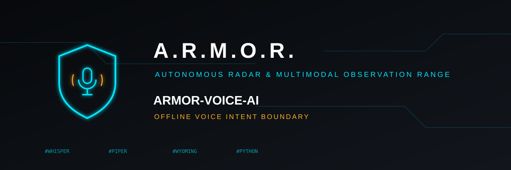

<p align="center">
  
</p>

# 🎙️ ARMOR-VOICE-AI

<p align="center">
  <a href="README.md">🇺🇸 English</a> |
  <a href="README_spa.md">🇪🇸 Español</a> |
  <a href="README_fra.md">🇫🇷 Français</a> |
  <a href="README_ita.md">🇮🇹 Italiano</a> |
  <a href="README_deu.md">🇩🇪 Deutsch</a> |
  <a href="README_zho.md">🇨🇳 简体中文</a> |
  🇯🇵 <b>日本語</b>
</p>

### 呼び出し側が偽造できない確認を備えたオフライン音声インテント

<p align="center">
  
  
  
  
</p>

---

**正直さのチェック - 今日動いているもの:** インテントの規則、署名付き確認、監査は実在し、テストされています（20 件）。**音声認識・合成エンジンはまだこのリポジトリに含まれていません。**

---

## 🎯 概要

* **閉じた許可リスト：** `status`、`silence`、`arm`、`disarm`。英語、スペイン語、ドイツ語、フランス語、イタリア語、日本語、中国語に対応し（応答は指定された言語で話されます）、アクセント、句読点、丁寧な前置きを正規化した後に判定します。それ以外や曖昧なものは理解されません。
* **サービスが発行する確認：** `arm` と `disarm` は最初のターンで署名付きトークンを返し、後のターンが同じインテントについて 30 s 以内にそれを返した場合のみ受け付けます。偽造、宛先の付け替え、再利用はできず、単なる `confirmed: true` の送信も拒否されます。
* **音声ではなく判断を記録：** `--audit-file` を使うと、各判断はインテント、結果、書き起こしの SHA-256 を記録し、音声や元の言葉は決して記録しません。
* **推奨のみ：** 受理されたコマンドは ARMOR-SERVER に渡され、そこで改めて認証と認可が行われます。

## 📂 リポジトリの構成

```text
ARMOR-VOICE-AI/
├── src/armor_voice_ai/   intent, confirmation, session, gateway
├── tests/
└── docs/SAFETY.md
```

## 🛠️ 開発環境

```powershell
$env:PYTHONPATH="src"
python -m unittest discover -s tests
echo '{"text":"arm the system"}' | python -m armor_voice_ai.gateway
```

[音声の安全性](docs/SAFETY.md)を参照。

## 🔗 関連プロジェクト

**A.R.M.O.R.**（Autonomous Radar & Multimodal Observation Range）は、独立したリポジトリで構成される周辺警備システムです。それぞれに独自のバージョン、テスト、README があります。ファミリーは次のとおりです：

* **[ARMOR-COMMON](https://github.com/JuanenRac/ARMOR-COMMON)** - メッセージ契約、検証器、適合性ベクトル、生成された型
* **[ARMOR-RADAR](https://github.com/JuanenRac/ARMOR-RADAR)** - ESP32-S3 用フィールドノードのファームウェア。レーダー 3 基と独自の Web パネル付き
* **[ARMOR-SOLAR](https://github.com/JuanenRac/ARMOR-SOLAR)** - 太陽光インバーターとバッテリーのプロトコル、およびゲートウェイノードのメッセージ
* **[ARMOR-ELECTRICAL](https://github.com/JuanenRac/ARMOR-ELECTRICAL)** - 電気ノード：電力量計、電力網の計測メッセージ、開閉のルール
* **[ARMOR-HMI](https://github.com/JuanenRac/ARMOR-HMI)** - タッチパネル：壁面ディスプレイでのシステム状態表示、警戒・確認操作、音声アシスタントの拠点
* **[ARMOR-NETWORK](https://github.com/JuanenRac/ARMOR-NETWORK)** - ローカルネットワーク：機器、インターネット、そして変化
* **[ARMOR-SERVER](https://github.com/JuanenRac/ARMOR-SERVER)** - 中央コーディネーター：テレメトリ、アラーム、デバイス、太陽光の測定値、カメラ
* **[ARMOR-STUDIO](https://github.com/JuanenRac/ARMOR-STUDIO)** - Web コンソール：カメラ、レーダー、アラーム、太陽光発電、2D/3D サイト設計
* **[ARMOR-ANDROID-CONTROL](https://github.com/JuanenRac/ARMOR-ANDROID-CONTROL)** - リアルタイム 2D/3D レーダー付きの Android オペレータークライアント
* **[ARMOR-SERVER-AI](https://github.com/JuanenRac/ARMOR-SERVER-AI)** - 判断を説明し、決して動作しない視覚推論ポリシー
* **ARMOR-VOICE-AI** (このリポジトリ) - 偽造できない確認を備えたオフライン音声インテント
* **[ARMOR-HARDWARE](https://github.com/JuanenRac/ARMOR-HARDWARE)** - 筐体、電子部品、ベンチ受け入れマトリクス
* **[ARMOR-DEVOPS](https://github.com/JuanenRac/ARMOR-DEVOPS)** - デプロイ、CM5 テストベンチ、バックアップ、TLS
* **[ARMOR-SIMULATOR](https://github.com/JuanenRac/ARMOR-SIMULATOR)** - 再現可能な故障を備えたオフラインのテレメトリシミュレーター
* **[ARMOR-UPDATER](https://github.com/JuanenRac/ARMOR-UPDATER)** - エコシステム自身のリポジトリを検出し、インストールし、更新する
* **[ARMOR-DOCS](https://github.com/JuanenRac/ARMOR-DOCS)** - アーキテクチャ、セキュリティ基準、機能マトリクス

## 📚 ドキュメントとコミュニティ

詳しくは：

* [機能マトリクス：実証済みのものとそうでないもの](https://github.com/JuanenRac/ARMOR-DOCS/blob/main/docs/CAPABILITY_MATRIX.md)
* [プロジェクト一覧：バージョンとリポジトリ間の依存関係](https://github.com/JuanenRac/ARMOR-DOCS/blob/main/docs/PROJECT_CATALOG.md)
* [このリポジトリの変更履歴](CHANGELOG.md)
* [ライセンス（GPL-3.0-or-later）](LICENSE)
* 質問・提案・報告：electrohobby3d@gmail.com

## 👤 作者

**JuanenRac (Electro Hobby 3D)** · electrohobby3d@gmail.com

## 📜 ライセンス

GPL-3.0-or-later - [LICENSE](LICENSE) を参照。
